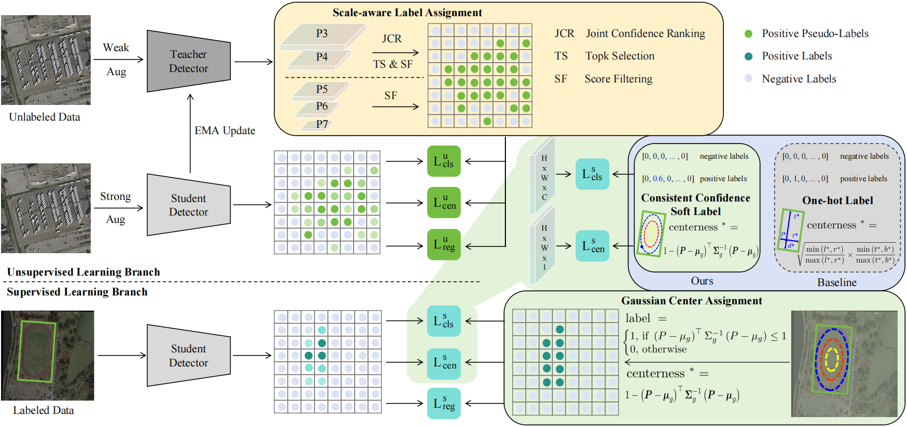

### Multi-clue Consistency Learning to Bridge Gaps Between General and Oriented Object in Semi-supervised Detection[https://arxiv.org/abs/2407.05909]


## Abstract

While existing semi-supervised object detection methods perform well in general scenes, they struggle with oriented objects. Our experiments reveal two inconsistency issues that stem from the gaps between general and oriented object detection in semi-supervised learning: 1) Assignment inconsistency: First, the common label assignment is inadequate for oriented objects with larger aspect ratios when selecting positive labels from labeled data. Second, balancing the precision and localization quality of oriented pseudo-boxes presents greater challenges, introducing more noise when selecting positive labels from unlabeled data. 2) Confidence inconsistency: there exists more mismatch between the predicted classification and localization qualities when considering oriented objects, affecting the selection of pseudo-labels. Therefore, we propose a Multi-clue Consistency Learning (MCL) framework to bridge the gaps between general and oriented objects in semi-supervised detection. Specifically, Gaussian Center Assignment is designed to select shape-aware positive labels from labeled data for oriented objects with larger aspect ratios, while Scale-aware Label Assignment is introduced to select scale-aware pixel-level pseudo-labels instead of unreliable pseudo-boxes from unlabeled data. The Consistent Confidence Soft Label is adopted to further boost the detector by maintaining the alignment of the predicted confidences. Experiments on DOTA-v1.5 and DOTA-v1.0 benchmarks demonstrate that the MCL can achieve state-of-the-art performance in the semi-supervised oriented object detection.


## Preparation

### Installation

MMRotate-0.3.4 depends on [PyTorch](https://pytorch.org/), [MMCV](https://github.com/open-mmlab/mmcv) and [MMDetection](https://github.com/open-mmlab/mmdetection).
Below are quick steps for installation.
Please refer to [Install Guide](https://mmrotate.readthedocs.io/en/latest/install.html) for more detailed instruction.

```shell
conda create -n mcl python==3.8 -y
conda activate mcl
pip install torch==1.13.1+cu116 torchvision==0.14.1+cu116 torchaudio==0.13.1 --extra-index-url https://download.pytorch.org/whl/cu116
pip install -U openmim
mim install mmcv-full
mim install mmdet\<3.0.0

git clone https://github.com/facias914/sood-mcl.git
cd sood-mcl

git clone https://github.com/open-mmlab/mmrotate.git    # 0.3.4
cd mmrotate
pip install -v -e .
```

### Data preparation

Details about split the images of DOTA into patches, please follow [MMrotate](https://github.com/open-mmlab/mmrotate/blob/main/tools/data/dota/README.md)

For spliting the DOTA-v1.5's train set via the released data list, please refer to [Data preparation of SOOD](https://github.com/HamPerdredes/SOOD)

The example of data setting:

```
/workspace/DOTA/v15/
├── train_split
│   ├── images
│   └── labelTxt
├── val_split
│   ├── images
│   └── labelTxt
├── test_split
│   ├── images
│   └── labelTxt  # Create an empty txt file for each image
├── train_xx_labeled
│   ├── images
│   └── labelTxt
└──train_xx_unlabeled
    ├── images
    └── labelTxt  # Create an empty txt file for each image
```

### Train

```shell
CUDA_VISIBLE_DEVICES=0,1 python -m torch.distributed.launch --nnodes=1 \
--node_rank=0 --master_addr="127.0.0.1" --nproc_per_node=2 --master_port=25500 \
train.py configs_dota15/mcl/......py \
--launcher pytorch \
--work-dir xxx
```


## Acknowledgement
The code is based upon:
[SOOD](https://github.com/HamPerdredes/SOOD).
Thanks for their great work!

The reproducible code of ARSL, DenseTeacher, PseCo, UnbiasedTeacher is based upon:
[ARSL](https://github.com/PaddlePaddle/PaddleDetection).
[DenseTeacher](https://github.com/Megvii-BaseDetection/DenseTeacher).
[PseCo](https://github.com/ligang-cs/PseCo).
[UnbiasedTeacher](https://github.com/facebookresearch/unbiased-teacher).
We appreciate all the authors who implement their methods. 

## Citation
```bibtex
@article{wang2024multi,
  title={Multi-clue Consistency Learning to Bridge Gaps Between General and Oriented Object in Semi-supervised Detection},
  author={Wang, Chenxu and Xu, Chunyan and Gu, Ziqi and Cui, Zhen},
  journal={arXiv preprint arXiv:2407.05909},
  year={2024}
}
```